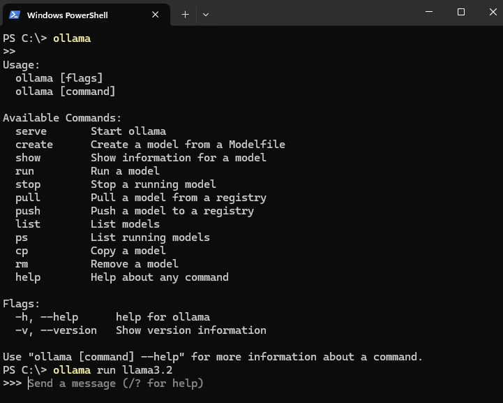
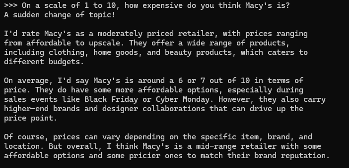

I had a question for the internet.  I was curious about whether the stores in Union Square in San Francisco are more high-end retail than other neighborhoods in the city.  On its face, this seems like a silly question.  Union Square is where the Tiffany's, the Sak's Fifth Ave, the Cartier, and the Bulgari (Bvlgari?) stores are.  When I walk around Union Square I generally get the impression that the stores there are not *for me*.  More about that in another post.

So I set out to try to quantify in some way the feeling I got.  My first thought was about Google Maps' dollar sign ratings and whether I could access those.  I decided not to try too hard with that though because I don't want to deal with API keys and paying Google.  I also am aware that there are likely already metrics out there about this kind of thing, but paying for some market research firm's output sounds way less fun than trying to generate some data myself.  Plus, what's sexier these days than working with LLMs.

So I started thinking about how we currently think about LLMs.  There's a lot of churn in the LLM space these days with everyone talking about agentic workflows and RAGs, but most of the documented workflows that people are using LLMs for are chatbots.  What if I wanted to ask an LLM a very specific question a bunch of times?  If an AI code assistant is best used as a conversational partner with the intelligence and attitude of an over-eager junior developer, maybe an LLM could function as an over-eager research intern.  After all, these things were theoretically trained on the entire internet, right?  They should be able to form an oppinion about how expensive they *think* a store *seems*.

## Setting up a Local LLM
I asked some colleagues who work with LLMs and surprisingly this is not the worst idea in the world, although nobody really knew of anyone using an LLM this way recently (I'm sure there is, but the internet is vast and full of garbage).  Someone suggested I look into [Ollama](https://ollama.com/) (their [GitHub repo](https://github.com/ollama/ollama) is particularly useful), which allows you to run these large language models locally.  Personally, this is pretty attractive as I'm not super into the idea of sharing all my data with OpenAI nor am I into the idea of burning down a small fraction of a rain forest somewhere to do so.

The Ollama install is super straightforward.  All you do is run their installer and then you can download individual models and interact with them through the PowerShell command line.



From there you have access to a bunch of different models you can download and work with ranging from 829 MB on the smaller end to 231 GB on the bigger end.
Running a quick test confirmed my bias that the LLM is a bit over-eager and really wants to be helpful.



The first line there is me feeding a prompt to the model and the rest of it is the model's response.  It gives A LOT of explanation and context.  In this case, I'm not super interested in the model's thought process as long as it gives me a number that makes sense, and in this case it does.  Concept proven(ish).  Now we can try to do this over and over with Ollama's Python API.

## Scaling Up the Analysis
Alright, so now I have an over-eager research intern who has scoured the entire internet at some point at my disposal.  The next question I have is whether it's possible or even a good idea to repeat this analysis at the scale of thousands of stores.

It turns out, Ollama has a [Python API](https://github.com/ollama/ollama-python) that seems like it should do the job.  With a quick pip install, I was off to the races.

```{python}
# pip install ollama

from ollama import chat, ChatResponse
```
Now, being the savvy developer I am, I basically just modified the hello world example from the Ollama documentation to ask my question

```{python}
response: ChatResponse = chat(
    model='llama3.2', 
    messages=[
        {
            'role': 'user',
            'content': f'''On a scale of 1 to 10, how expensive do you think Macy's is?''',
        },
    ]
)

print(response.message.content)
```